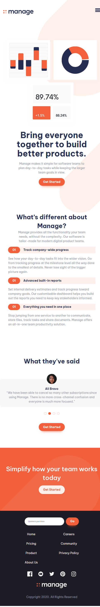

# Frontend Mentor - Manage landing page


#This is a solution to the [Manage landing page challenge on Frontend Mentor](https://www.frontendmentor.io/challenges/manage-landing-page-SLXqC6P5). Frontend Mentor challenges help you improve your coding skills by building realistic projects.

## Table of contents

- [Overview](#overview)
  - [The challenge](#the-challenge)
  - [Screenshot](#screenshot)
  - [Links](#links)
- [My process](#my-process)
  - [Built with](#built-with)
  - [What I learned](#what-i-learned)
- [Author](#author)
- [Acknowledgments](#acknowledgments)

## Overview

### The challenge

Users should be able to:

- View the optimal layout for the site depending on their device's screen size
- See hover states for all interactive elements on the page
- See all testimonials in a horizontal slider
- Receive an error message when the newsletter sign up `form` is submitted if:
  - The `input` field is empty
  - The email address is not formatted correctly

### Screenshot




### Links

- Solution URL: [https://github.com/Ifescohub/manage-landing-page](https://github.com/Ifescohub/manage-landing-page)
- Live Site URL: [https://manage-landing-p.netlify.app/](https://manage-landing-p.netlify.app/)

## My process

### Built with

- Semantic HTML5 markup
- HTML Assessibility tags
- CSS custom properties
- Flexbox
- CSS Grid
- Mobile-first workflow
- Vanilla Javascript
- Slider js

### What I learned

I learnt a lot through this project. I learnt how to use slider js to make carousel.
```js
const swiper = new Swiper('.swiper', {
  // Optional parameters
  direction: 'horizontal',
  slidesPerView: 1,
  spaceBetween: 30,
  slidesPerGroup: 1,
  loopFillGroupWithBlank: true,
  pagination: {
    el: ".swiper-pagination",
    clickable: true,
  },
  breakpoints: {
    600: {
      slidesPerView: 2,
    },
    960: {
      slidesPerView: 3
    },
    1300: {
      slidesPerView: 4
    }
  }
});
}
```

## Author

- GitHub - [Udeh Ifeanyi](https://github.com/Ifescohub)
- Frontend Mentor - [@ifescohub](https://www.frontendmentor.io/profile/Ifescohub)
- Twitter - [@UdehIfeanyi10](https://twitter.com/UdehIfeanyi10)

## Acknowledgments

Kelvin Powel's tutorial helped me alot with my CSS.

